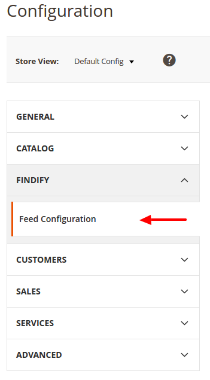
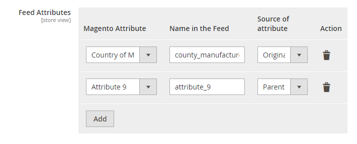

Findify for Magento 2
=====================

The Findify extension allows you to generate a product feed containing all enabled products of your Magento store view.
For a multi-language or a multi-sites store, a distinct feed can be generated for each store view.

The main features of this extension are:
- Schedule the generation of the feeds
- Configure the attributes of the feeds

Magento compatible versions: 2.1

## How to install the extension?

* Download the compressed [ZIP file](https://github.com/findify/findify-magento2/archive/master.zip "ZIP") containing the extension from Github.
* Unzip it at the root of the Magento folder.

## Extension configuration

Once the extension has been installed, you can access the Findify feed configuration by navigating to "System > Configuration".
On the left menu, click on "Findify", then "Feed Configuration".



## Feed Attributes
To add a new field to the feed you just need to:
- Choose the Magento attribute thanks to the drop-down on the left of the table.
- Assign a name to this attribute on the right. 



## Force the generation of the feed
Connect in SSH to the Magento server and run the following command:

```bash
php bin/magento findify:run_cron 
```
