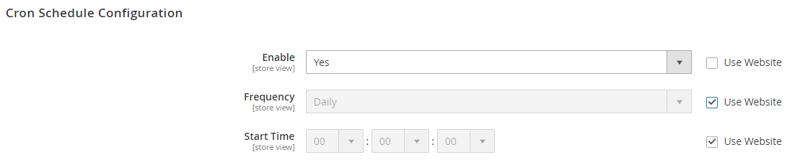
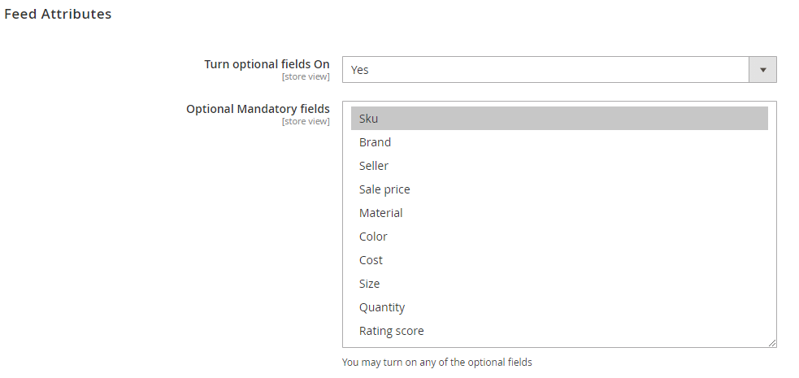
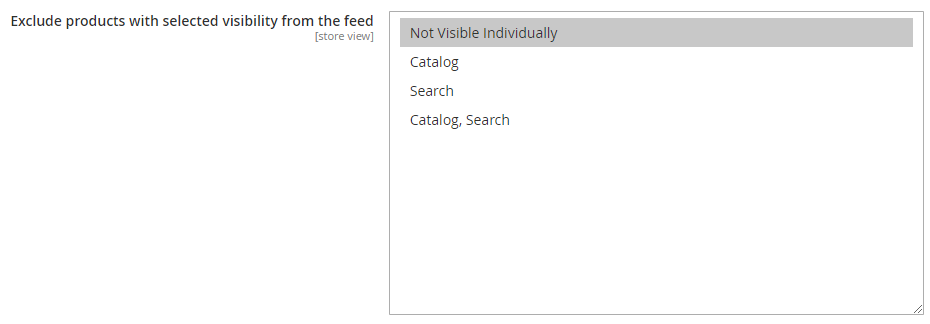
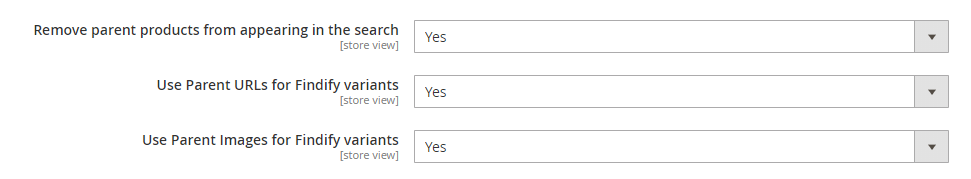
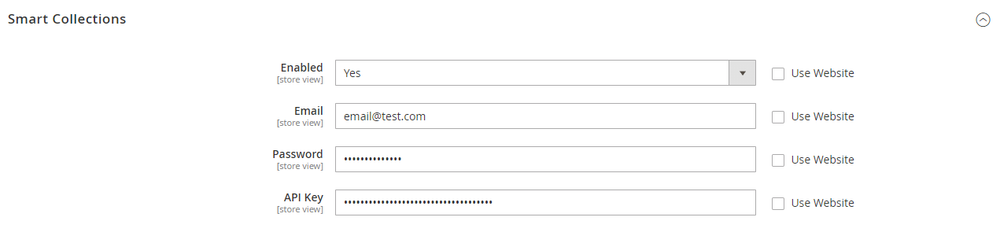

Findify for Magento 2
=====================

The Findify extension allows you to generate a product feed containing all enabled products of your Magento store view.
For a multi-language or a multi-sites store, a distinct feed can be generated for each store view.

## How to install the extension?
#### Download compressed file

* Download the compressed [ZIP file](https://github.com/madepeople/findify-magento2/archive/master.zip "ZIP") containing the extension from Github.
* Unzip it at the root of the Magento folder.
* Check that the webserver is allowed to write in the folder `/media/findify` so the feed can be generated
* Flush the Magento cache so the XML configuration files are reloaded
* Log out and login again from your Magento admin panel, so the permissions are applied

No Magento core file is removed or rewritten.

#### Module installation via composer
 
 In composer.json under require put:
 ```
 "findify/findify": "dev-master#{{latest commit hash}}"
 ```
 
 Also, run this command via the command line:
 ```
 composer config repositories.findify vcs git@github.com:findify/findify-magento2.git
 ```
## How to configure the extension?

Once the extension has been installed, you can access the Findify configuration by navigating to **Stores** > **Configuration**.
On the left menu, click on **Findify**, then **Findify Configuration**.


## How to configure the generation schedule?

### Enable / Disable the feed generation
By default, all the views of your Magento store are disabled to produce a Findify feed. 
To enable the feed generation, select the **Store View**, go to the section **Cron Schedule Configuration**, uncheck the checkbox **Use Website** and set **Enabled** to *Yes*.
However, if your store has more than 100K products, it is recommended to disable the view product feed generation for the views you will not use Findify on. 
You may always [run feed generation manually](#manual-generation-of-the-product-feed) using Magento CLI.


### Set the cron daily schedule

You can specify the exact time when the extension will generate the product feed. By default, it will create the feed at 0:00 am.



### Specify Folder for a feed

You may specify a folder, where generated feed is going to be placed within _pub/media_. By default, the path is _pub/media/findify/feed_. 


## What is in the product feed generated?
By default, every feed will have the following mandatory fields :

|Name of the field|    Description    |Example|
| --- | --- | ---|
|`id`| Unique identifier of the product. This identifier must be unique across all products.| 100201 |
|`item_group_id`| Common identifier for all variants of the same product. If there are no variants present for the product, uses the same value as id| 100205 |
|`title`| Title of the product. | Men's Pique Polo Shirt|
|`description`|    Description of the product.| Solid red, king-sized bed sheets made from 100% woven polyester 300-thread count fabric. Set includes one fitted sheet, one flat sheet and two standard pillowcases. Machine washable; extra-deep fitted pockets.|
|`price`| Price of the product.| 15.99|
|`image_url`| URL of the product image. For a best displaying quality, the image must have a size of 180px * 180px.    |http://www.example.co.uk/image1.jpg|
|`product_url`|    URL of the product page.| http://www.example.com/clothing/dress-blue|
|`category`| Category of the product. Subcategories are split using the `>` delimiter.| Clothing & Accessories > Clothing > Dresses|
|`thumbnail_url`| URL of the product thumbnail image. The thumbnail image must have a size of 65px * 65px.|    http://www.example.co.uk/image1_thumb.jpg|
|`availability`| Availability status of the product (‘in stock” or “out of stock”).    |in stock|
|`created_at`| Date when the product has been made available to the users (format ISO-8601). |2014-04-22T06:00:00Z|

You may add to the feed any of the optional fields:

|Name of the field|    Description    |Example|
| --- | --- | ---|
|`sku`|    SKU of the product. Even if the "id" of the product is the SKU, you need to add a dedicated "sku" field. |126373-AOP|
|`brand`| Brand of the product.    |Calvin Klein|
|`seller`| Seller of the product. |Calvin Shop|
|`sale_price`| Advertised sale price of the product. |13.65|
|`material`| Material of the product. |cotton|
|`cost`| Cost of the product. margin = price - cost    |10.50|
|`color`| Color of the product.    |red|
|`size`| Size of the product. |34|
|`quantity`| Quantity of the product |98|
|`created_at`| Date when the product has been made available to the users (format ISO-8601). |2014-04-22T06:00:00Z|
|`rating_score`| Rating score of the product. |3.5|

We suggest adding at least `sku` field. That is why we enabled Optional fields by default and pre-selected the `sku` field.
However, you may disable them or include any other optional fields. You find a list of optional fields in **Feed Attributes** section:



Any other Magento attribute you wish to make searchable or transform to a filter can be added to the feed attributes table. 

 ### How to add stores attributes to the Findify product feed?
 
 To add a new field to the feed you just need to:
 - Choose the Magento attribute thanks to the drop-down on the left of the table.
 - Assign a name to this attribute on the right. 
 - Select the source of the Attribute. It may be either Original product or Parent one.
 


### Specific Magento-Findify settings

By default any Not Visible Individually product is excluded from the feed. You may specify this setting.



There might be a case when product configurable price is different than their child prices.
Findify uses `item_group_id` field for grouping variants with their parent product. In a search page, it shows a combined result, which consists of the price range of all products with the same `item_group_id`, both configurable product and its children.
It may cause a confusion in a product price. Removing the configurable product from the feed will fix the issue, let the price be combined only from children products.
By default, **Remove parent products from appearing in the search** is turn **On** 

There might be cases when Product URLs for Findify Variants should be pulled from their parent product. In general, simple child products are not single visible, thus their Product URL is not working and useless.
By default, **Use Parent URLs for Findify variants** is turn **On** 
 
The same thing relates to variants' images. A configurable product might have its own images, while child product might not have ones.
By default, **Use Parent Images for Findify variants** is turn **On** 



##### Notice
The products collection is tied up with Stock Inventory Options. Products which are "Out of Stock" are being excluded 
from the feed as they are not displayed in Frontend by default. You may change the setting:
 _Catalog / Inventory / Stock Option / Display Out of Stock Products_ to _Yes_ to make such products get into the feed.
 
 ## Manual generation of the product feed
 
 Feeds can be generated from a command line. 
 Connect via SSH to the Magento server and run the following command from the store path (example: */var/www/www.mystore.com/*):
 You may specify a store view(s) by using an option '--store' or shortcut '-s'.
 
 All active stores:
 ```
 php bin/magento findify:datafeed:generate
```
Specific store "eu":
 ```
 php bin/magento findify:datafeed:generate --store  eu
```
A list of stores "eu" and "se":
 ```
 php bin/magento findify:datafeed:generate -s eu -s se
```
 
 ## How to enable Findify on the store?
 
At the end of the onboarding, a link to a JS file will be displayed in Findify's dashboard. Copy this link and come back to the Magento Findify extension. Check the box "Enabled" and paste this link into the section **JS Integration** (in the view scope)


Search results will be displayed at _"/search"_ URL. Please, make sure you define the same URL path in Findify's setting: _Setup / Advanced Setup / Search Results_ 
  
 ## API
  
 ### Creating smart collections in Findify
 To programmatically create smart collections in Findify we can use one of two methods:
 * Console command: `bin/magento findify:datafeed:createSmartCollections`
 * Indexer:
    * In Admin under System -> Index Management
    * From the command line: `bin/magento indexer:reindex findify_findify_generate_smart_collections`
 
 ### Smart Collections
 
 In Order to use API, you need to Enable it and set the credentials: email and password of Findify's account.
 API key can be found in Findify's dashboard, inside "Sync, Status & Usage" menu



 To get a list of all the smart collections for a default store you can go to:
  ```
  http://{domain_name}/rest/V1/findify/smartcollections/list
  ```

 To get a list of all the smart collections for a specific store you can go to: 
 ```
 http://{domain_name}/rest/V1/findify/smartcollections/fetch/{storeCode}
 ```
 
 An example JSON response you will receive:
 ```
 <response>
   <item>
     <id>122891</id>
     <slot>women/athletic-socks</slot>
     <query>
       <filters>
         <item>
           <type>category</type>
           <name>category</name>
           <action>include</action>
           <values>
             <item>
               <value>Women>Athletic Socks</value>
             </item>
           </values>
           <type>text</type>
           <name>color</name>
           <action>include</action>
         </item>
       </filters>
       <q/>
     </query>
     <enabled>true</enabled>
     <showConfiguredFilters>false</showConfiguredFilters>
     <created_at>2019-06-25T14:48:48.028Z</created_at>
     <updated_at>2019-06-26T06:40:27.959Z</updated_at>
   </item>
   <item>
 </response>
 ```
