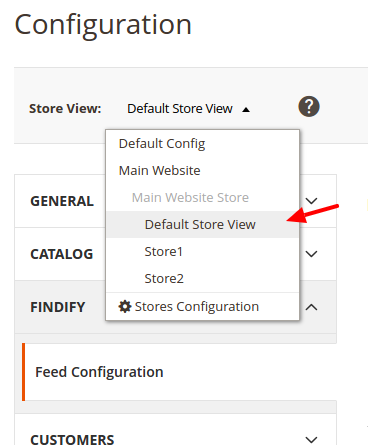
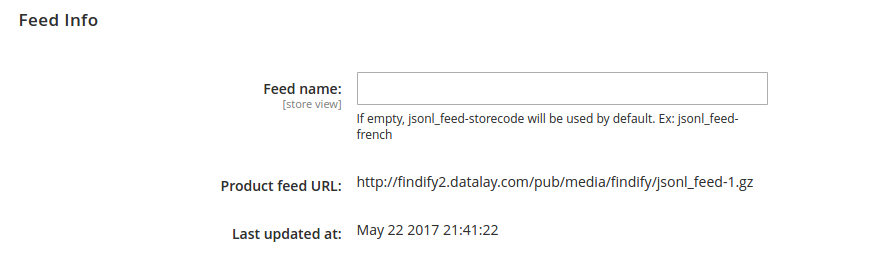

Findify for Magento 2
=====================

The Findify extension allows you to generate a product feed containing all enabled products of your Magento store view.
For a multi-language or a multi-sites store, a distinct feed can be generated for each store view.

The main features of this extension are:
- Schedule the generation of the feeds
- Configure the attributes present in the product feed

Magento compatible versions: 2.1 or higher
The extension has not been tested on Magento < 2.1, it is recommended to install the Magento patches to upgrade your store to at least the version 2.1.

## How to install the extension?

* Download the compressed [ZIP file](https://github.com/findify/findify-magento2/archive/master.zip "ZIP") containing the extension from Github.
* Unzip it at the root of the Magento folder.
* Check that the webserver is allowed to write in the folder `/media/findify` so the feed can be generated
* Flush the Magento cache so the XML configuration files are reloaded
* Log out and login again from your Magento admin panel so the permissions are applied

No Magento core file is removed or rewritten.

## How to configure the extension?

Once the extension has been installed, you can access the Findify configuration by navigating to **Stores** > **Configuration**.
On the left menu, click on **Findify**, then **Feed Configuration**.


## How to add stores attributes to the Findify product feed?

To add a new field to the feed you just need to:
- Choose the Magento attribute thanks to the drop-down on the left of the table.
- Assign a name to this attribute on the right. 


## How to configure the generation schedule?

### Enable / Disable the feed generation
By default, all the views of your Magento store are enabled to produce a Findify feed. However, if your store has more than 50K products, it is recommended to disable the view product feed generation for the views you will not use Findify on. In order to disable the feed generation, select the **Store View**, go to the section **Feed Schedule**, uncheck the checkbox **Use Website** and set **Enabled** to *No*.

### Set the cron daily schedule

You can specify the exact time when the product feed will be generated by the extension. By default, it will generate the feed at 1:30am.

### Manual generation of the product feed

You can always generate manually the product feed, using the Magento CLI.
Connect in SSH to the Magento server and run the following command from the store path (example: */var/www/www.mystore.com/*):

```bash
php ./bin/magento findify:run_cron 
```

## What is in the product feed generated?
By default, every feed will have the following information:
* id
* sku
* name
* short description
* long description
* price
* special price (in case it is present)
* image URL
* thumbnail URL
* product URL
* categories
* availability
* created_at: most recent date between "New from date" and the product creation date
* item_group_id
* type_id: indicates the type of the product (configurable, simple, bundle, grouped)
* visibility

Any other Magento attribute you wish to make searchable or transform to a filter can be added to the feed attributes table. Choosing a different scope will allow you to specify different attributes for each view.

## How to get my Findify product feed URL?
In the view scope, a section is present that displays the product feed URL and the latest date at which the product feed has been generated.

**Findify needs the product feed URL**

You can:
* Change the feed name (optional)
* Copy the product feed URL
* See when was the last time the feed has been generated




## How to enable Findify on the store?
At the end of the onboarding, a link to a JS file will be displayed. Copy this link and come back to the Magento Findify extension. Paste this link into the block "JS Integration" (in the view scope) and check the box "Enabled".

